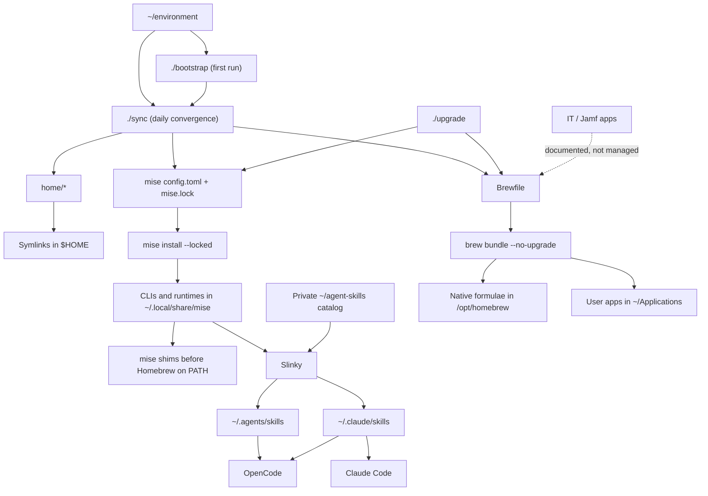

# environment

Work Mac dotfiles and package configuration.

## TL;DR

- Developer runtimes and CLIs are declared directly in
  `home/.config/mise/config.toml` and resolved by `mise.lock`.
- GUI apps and native macOS dependencies are declared directly in `Brewfile`.
- `./sync` links dotfiles, installs locked mise tools, and installs missing
  Brewfile entries. It does not remove undeclared software or upgrade packages.
- `./upgrade` is the explicit update path.
- IT/Jamf-managed software is outside this setup.

There are two package sources of truth:

- `home/.config/mise/config.toml` for developer runtimes and CLIs
- `Brewfile` for macOS applications, native libraries, and formula exceptions

No manifest or generated package files sit between those configs and their
package managers.

## How it works



Homebrew initializes before mise, then mise's stable shim directory is placed
ahead of Homebrew on `PATH`. This lets Homebrew provide libraries and declared
exceptions without shadowing mise-managed developer tools.

## Quick start

### Fresh setup

```bash
git clone git@github.com:agomez-arine/environment.git ~/environment
cd ~/environment
./bootstrap
```

`bootstrap` installs Homebrew and mise when needed, links `home/` into `$HOME`,
installs the locked mise tools and Brewfile entries, clones the two zsh plugins,
bootstraps the private skills catalog, and installs this repository's Git hooks.

### Daily convergence

```bash
git pull && ./sync
```

### Add a CLI or runtime

Edit `home/.config/mise/config.toml`, then run:

```bash
mise lock --global
./sync
```

### Add a GUI or native dependency

Edit `Brewfile`, then run:

```bash
./sync
```

### Upgrade deliberately

```bash
./upgrade --dry-run
./upgrade
```

Review and commit changes to `home/.config/mise/mise.lock` after a mise
upgrade.

### Remove software

Delete its declaration first. Preview the native cleanup before applying it:

```bash
brew bundle cleanup --file=~/environment/Brewfile
brew bundle cleanup --force --file=~/environment/Brewfile

mise lock --global
mise prune --dry-run
mise prune --yes
```

### Diagnose

```bash
mise install --locked --dry-run
brew bundle check --no-upgrade --verbose --file=~/environment/Brewfile
mise doctor
```

## Ownership rules

Use mise for developer CLIs and runtimes. Use Homebrew Cask for GUI apps. Use
Homebrew formulae only for native libraries or tools that mise cannot provide
reliably.

IT/Jamf-managed applications do not belong in the Brewfile. They are listed in
its comments for visibility, but Homebrew must not adopt them.

## Agent skills

[Slinky](https://github.com/gcavanunez/slinky) manages the separate private
`~/agent-skills` catalog and materializes enabled skills for both Claude Code
and OpenCode:

```bash
slinky status
slinky sync --dry-run
slinky sync
slinky                         # open the TUI
```

Add an upstream skill through Slinky so its provenance stays recorded:

```bash
slinky skills add owner/repo --skill skill-name
slinky update --check
```

Do not edit the materialized copies under `~/.agents/skills` or
`~/.claude/skills`. Edit local catalog skills through Slinky, and accept or
restore vendor updates through its review workflow.

`./bootstrap` clones and reconciles the private catalog on a fresh Mac. Slinky
sync remains explicit because it can save catalog changes, pull its repository,
and restore vendor drift.

## Git metadata

`~/environment/.git/` is local repository metadata. Git never tracks its own
`.git/` directory, and it should not appear in a diff.

`home/.gitconfig` is different: it is an intentionally tracked dotfile that
`./sync` links to `~/.gitconfig`. Changes to your global Git configuration can
therefore appear as changes to `home/.gitconfig`, which is expected. Secrets and
GitHub login tokens are not stored there.

## Layout

```text
~/environment/
├── Brewfile                    # GUI apps and Homebrew exceptions
├── bootstrap                   # one-time setup
├── sync                        # missing-only convergence
├── upgrade                     # explicit update path
├── home/                       # mirrors $HOME and is symlinked into place
│   └── .config/mise/
│       ├── config.toml         # developer tools
│       └── mise.lock           # resolved versions and artifacts
├── docs/                       # tool notes and migration research
└── local/                      # untracked machine secrets and overrides
```

The repository intentionally targets the work Mac. Project-specific tool
versions belong in each project's own `mise.toml` or language lockfile.
